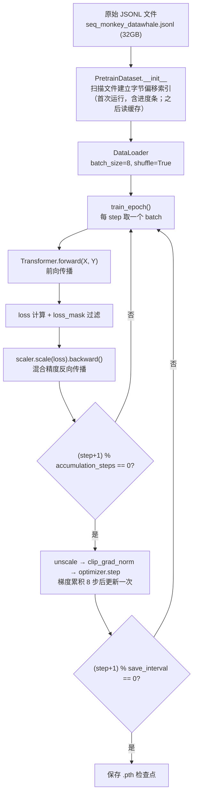
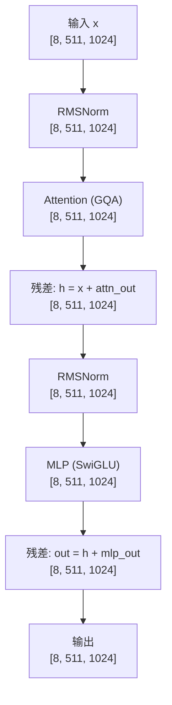
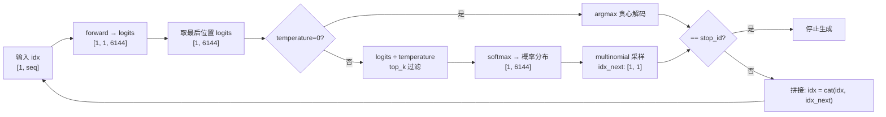

# LLaMA2 模型数据流与张量变换全解析

> [!NOTE]
> 以下分析基于**实际训练配置**（`train_model.py` 中的 `ModelConfig`）：
> `dim=1024, n_layers=18, n_heads=16, n_kv_heads=8, vocab_size=6144, max_seq_len=512`
> 训练参数：`batch_size=8, accumulation_steps=8`，输入序列长度 `seq_len=511`（X = input_id[:-1]）

---

## 0. 完整训练流程概览



---

## 1. 数据流：从磁盘到 GPU

### 1.1 PretrainDataset 初始化

```python
# src/dataset.py — PretrainDataset.__init__
cache_file = data_path + ".offsets.npy"
# 首次运行：逐字节扫描整个文件，记录每行起始偏移量
# 后续运行：直接从 .npy 文件加载，秒级完成
```

对于 32GB 文件：
- **首次**：约 46 秒，生成 `.offsets.npy` 缓存
- **之后**：直接 `np.load()`，瞬间完成

### 1.2 \__getitem__ — 单样本处理

```python
# 输入：JSONL 中的一行 {"text": "..."}
text = f"{tokenizer.bos_token}{sample['text']}"   # 拼接 BOS token

input_id = tokenizer(text).data['input_ids'][:512]   # 截断到 512 token
text_len = len(input_id)                              # 实际长度
padding_len = 512 - text_len
input_id = input_id + [pad_token_id] * padding_len   # 填充到 512
loss_mask = [1]*text_len + [0]*padding_len            # 实际内容=1，padding=0
```

```
input_id: [BOS, t1, t2, ..., tN, PAD, PAD, ...]  长度=512
   ↓ 错位分割
X = input_id[:-1]  →  [BOS, t1, t2, ..., tN-1, PAD, ...]  长度=511  ← 输入
Y = input_id[1:]   →  [t1,  t2, ..., tN,  PAD, ...]        长度=511  ← 目标
loss_mask = mask[1:]  长度=511  (PAD位置=0，不参与loss计算)
```

### 1.3 DataLoader 组装 Batch

```
X:          [8, 511]   int64   ← 8个样本的输入序列
Y:          [8, 511]   int64   ← 8个样本的目标序列
loss_mask:  [8, 511]   int64   ← 哪些位置需要计算loss
```

---

## 2. 学习率调度（余弦退火 + Warmup）

```python
# train_model.py — get_lr(it, total, args)
min_lr = learning_rate / 10  # 2e-5

# 阶段1：warmup_iters=0，直接跳过
# 阶段2：余弦退火
decay_ratio = (it - warmup_iters) / (total - warmup_iters)  # 0→1
coeff = 0.5 * (1 + cos(π × decay_ratio))  # 1→0
lr = min_lr + coeff × (learning_rate - min_lr)  # 2e-4 → 2e-5
```

```
全局step = epoch × iter_per_epoch + step_in_epoch
iter_per_epoch = 3,624,874（batch_size=8时）
```

---

## 3. Transformer 前向传播（核心）

> 输入：`X: [8, 511]`，`Y: [8, 511]`

### 3.1 Token Embedding

```python
h = self.tok_embeddings(tokens)   # nn.Embedding(6144, 1024)
h = self.dropout(h)               # Dropout(p=0.0，训练时不起作用)
```

```
tokens:  [8, 511]       ← 整数 token ID
h:       [8, 511, 1024] ← 每个 token 映射为 1024 维向量
```

### 3.2 截取 RoPE 频率矩阵

```python
freqs_cos = self.freqs_cos[:511]  # [511, 32]  ← head_dim//2 = 1024/16/2 = 32
freqs_sin = self.freqs_sin[:511]  # [511, 32]
```

预计算范围是 `max_seq_len=512`，按实际序列长度 511 截取。

---

## 4. DecoderLayer × 18 层（每层结构相同）

```python
# Pre-Norm 结构
h = x + self.attention(self.attention_norm(x), freqs_cos, freqs_sin)
out = h + self.mlp(self.ffn_norm(h))
```



> [!IMPORTANT]
> **Pre-Norm**：Norm 在 Attention/MLP **之前**做，这与原始 Transformer 的 Post-Norm 不同。  
> **RMSNorm** 而非 LayerNorm：`x * rsqrt(mean(x²) + eps) * weight`，无 bias，更高效。

---

## 5. Attention 详解（GQA — 分组查询注意力）

> [!IMPORTANT]
> Q 有 **16 个头**，KV 只有 **8 个头**，每 2 个 Q 头共享 1 组 KV，显著节省 KV Cache 显存。

### 关键参数（基于 dim=1024 配置）

| 参数 | 值 | 含义 |
|---|---|---|
| `n_heads` | 16 | Query 头数 |
| `n_kv_heads` | 8 | Key/Value 头数 |
| `n_rep` | 2 | 每组 KV 被复制次数（16/8） |
| `head_dim` | 64 | 每个头的维度（1024/16） |

### 5.1 线性投影 Q、K、V

```python
xq = self.wq(x)   # Linear(1024, 1024)  → 16 heads × 64 head_dim
xk = self.wk(x)   # Linear(1024, 512)   →  8 heads × 64 head_dim
xv = self.wv(x)   # Linear(1024, 512)   →  8 heads × 64 head_dim
```

```
x:   [8, 511, 1024]

xq:  [8, 511, 1024] → view → [8, 511, 16, 64]
xk:  [8, 511,  512] → view → [8, 511,  8, 64]
xv:  [8, 511,  512] → view → [8, 511,  8, 64]
```

### 5.2 RoPE 旋转位置编码（apply_rotary_emb）

```python
xq, xk = apply_rotary_emb(xq, xk, freqs_cos, freqs_sin)
```

```
步骤 1：拆分实部虚部
  xq: [8, 511, 16, 64] → reshape(-1,2) → [8, 511, 16, 32, 2] → unbind(-1)
      xq_r: [8, 511, 16, 32]   实部
      xq_i: [8, 511, 16, 32]   虚部
  xk 同理（16→8）

步骤 2：广播频率矩阵
  freqs_cos: [511, 32] → reshape → [1, 511, 1, 32]

步骤 3：复数旋转
  xq_out_r = xq_r × cos - xq_i × sin
  xq_out_i = xq_r × sin + xq_i × cos

步骤 4：合并
  xq_out: stack+flatten → [8, 511, 16, 64]   # 形状恢复
  xk_out: stack+flatten → [8, 511,  8, 64]
```

> [!TIP]
> RoPE 核心：位置 m 和位置 n 的点积只取决于 **相对位置 (m-n)**，天然支持任意长度的相对位置泛化。

### 5.3 GQA：KV 头复制（repeat_kv）

```python
xk = repeat_kv(xk, n_rep=2)   # [8, 511, 8, 64] → [8, 511, 16, 64]
xv = repeat_kv(xv, n_rep=2)   # [8, 511, 8, 64] → [8, 511, 16, 64]
```

```
实现：x[:,:,:,None,:].expand(...,2,...).reshape(...)
每个 KV 头被复制一次，与对应的 2 个 Q 头配对
```

### 5.4 转置 + 注意力计算

```python
xq = xq.transpose(1, 2)   # [8, 16, 511, 64]
xk = xk.transpose(1, 2)   # [8, 16, 511, 64]
xv = xv.transpose(1, 2)   # [8, 16, 511, 64]
```

#### Flash Attention（默认路径）：
```python
output = F.scaled_dot_product_attention(xq, xk, xv, is_causal=True,
                                         dropout_p=0.0)
# output: [8, 16, 511, 64]
```

等价于（但无需显式存储 [8,16,511,511] 注意力矩阵）：
```
scores = xq @ xkᵀ / √64              → [8, 16, 511, 511]
scores = causal_mask(scores)           → 上三角 = -inf
scores = softmax(scores, dim=-1)       → [8, 16, 511, 511]
output = scores @ xv                   → [8, 16, 511, 64]
```

> [!NOTE]
> 因果掩码（Causal Mask）确保位置 i 只能 attend 到 0…i，防止信息泄漏。
> Flash Attention 通过分块计算避免了 511×511 的全矩阵，省显存且更快。

### 5.5 输出投影

```python
output = output.transpose(1, 2).contiguous().view(bsz, slen, -1)
# [8, 16, 511, 64] → [8, 511, 16, 64] → [8, 511, 1024]

output = self.resid_dropout(self.wo(output))
# wo: Linear(1024, 1024) → [8, 511, 1024]
```

---

## 6. MLP（SwiGLU 结构）

```python
# hidden_dim 自动计算：4×1024=4096 → ×2/3≈2730 → 对齐64 → 2752
hidden_dim = 2752
```

| 权重 | 形状 | 作用 |
|---|---|---|
| `w1` | Linear(1024, 2752) | 门控分支 |
| `w3` | Linear(1024, 2752) | 值分支 |
| `w2` | Linear(2752, 1024) | 降维输出 |

```python
def forward(self, x):
    return self.dropout(self.w2(F.silu(self.w1(x)) * self.w3(x)))
```

```
x:              [8, 511, 1024]
w1(x):          [8, 511, 2752]   ← 升维（门控信号）
SiLU(w1(x)):    [8, 511, 2752]   ← SiLU = x·σ(x)，平滑激活
w3(x):          [8, 511, 2752]   ← 升维（值信号）
SiLU × w3(x):  [8, 511, 2752]   ← 逐元素相乘（门控机制）
w2(…):          [8, 511, 1024]   ← 降回原始维度
```

---

## 7. 输出层

### 7.1 最终 RMSNorm

```python
h = self.norm(h)   # RMSNorm(1024)
# [8, 511, 1024] → [8, 511, 1024]
```

### 7.2 LM Head（训练 vs 推理）

```python
# 训练模式（有 targets）：对所有位置计算 logits
logits = self.output(h)              # Linear(1024, 6144)
# [8, 511, 1024] → [8, 511, 6144]

# 推理模式（无 targets）：只取最后一个 token
logits = self.output(h[:, [-1], :])
# [8, 1, 1024] → [8, 1, 6144]
```

> [!IMPORTANT]
> **权重共享**：`tok_embeddings.weight = output.weight`  
> Embedding（6144×1024）和 LM Head 共享同一矩阵，节省 ~6M 参数。

---

## 8. Loss 计算（训练）

```python
# Transformer.forward 中：
self.last_loss = F.cross_entropy(
    logits.view(-1, 6144),    # [8×511=4088, 6144]  展平
    targets.view(-1),          # [4088]
    ignore_index=0,            # 忽略 pad_token_id=0
    reduction='none'           # 逐 token 的 loss，不聚合
)
# self.last_loss: [4088]

# train_epoch() 中：
loss = out.loss / accumulation_steps      # [4088]  ÷ 8
loss_mask = loss_mask.view(-1)            # [4088]  (0或1)
loss = torch.sum(loss * loss_mask) / loss_mask.sum()
# 只对实际文本位置（非 padding）求平均
```

```
示例（简化为 seq_len=5）：
  loss per token:  [2.1, 1.8, 0.0, 0.0, 0.0]   (后3个是padding)
  loss_mask:       [1,   1,   0,   0,   0  ]
  有效loss = (2.1+1.8) / 2 = 1.95
```

> [!TIP]
> `ignore_index=0` 和 `loss_mask` 双重过滤确保 padding 完全不影响梯度。

---

## 9. 梯度更新（混合精度 + 梯度累积）

```python
# 混合精度反向传播
scaler.scale(loss).backward()

# 每 8 步执行一次实际更新
if (step + 1) % 8 == 0:
    scaler.unscale_(optimizer)
    clip_grad_norm_(model.parameters(), max_norm=1.0)   # 梯度裁剪
    scaler.step(optimizer)    # Adam 更新
    scaler.update()           # 调整缩放因子
    optimizer.zero_grad(set_to_none=True)
```

```
梯度累积逻辑：
  step 0: loss/8 → backward（梯度累积）
  step 1: loss/8 → backward（梯度累积）
  ...
  step 7: loss/8 → backward → 执行 optimizer.step
  ─────────────────────────────────────────
  效果等价于 batch_size = 8 × 8 = 64 的训练
```

---

## 10. 推理：自回归生成（generate）

```python
@torch.inference_mode()
def generate(self, idx, stop_id=None, max_new_tokens=256, temperature=1.0, top_k=None):
```



---

## 11. 完整张量变换速查表

> 配置：`dim=1024, n_layers=18, n_heads=16, n_kv_heads=8, vocab_size=6144`  
> 训练输入：`batch_size=8, seq_len=511`

| 阶段 | 操作 | 输入形状 | 输出形状 |
|---|---|---|---|
| 数据 | PretrainDataset | JSONL 行 | X/Y: `[511]` int64 |
| | DataLoader | 8个样本 | `[8, 511]` int64 |
| **Embedding** | `tok_embeddings` | `[8, 511]` | `[8, 511, 1024]` |
| | Dropout | `[8, 511, 1024]` | `[8, 511, 1024]` |
| | 截取 RoPE | `[512, 32]` | `[511, 32]` freqs |
| **×18 DecoderLayer** | RMSNorm | `[8, 511, 1024]` | `[8, 511, 1024]` |
| **Attention** | `wq` 投影 | `[8, 511, 1024]` | `[8, 511, 16, 64]` |
| | `wk` 投影 | `[8, 511, 1024]` | `[8, 511, 8, 64]` |
| | `wv` 投影 | `[8, 511, 1024]` | `[8, 511, 8, 64]` |
| | RoPE | Q/K 不变形状 | 值被旋转 |
| | repeat_kv | `[8, 511, 8, 64]` | `[8, 511, 16, 64]` |
| | transpose | `[8, 511, 16, 64]` | `[8, 16, 511, 64]` |
| | Flash Attn | Q/K/V: `[8,16,511,64]` | `[8, 16, 511, 64]` |
| | 合并多头 | `[8, 16, 511, 64]` | `[8, 511, 1024]` |
| | `wo` 投影 | `[8, 511, 1024]` | `[8, 511, 1024]` |
| | 残差 | `[8,511,1024]` ×2 | `[8, 511, 1024]` |
| **MLP** | RMSNorm | `[8, 511, 1024]` | `[8, 511, 1024]` |
| | `w1`/`w3` 升维 | `[8, 511, 1024]` | `[8, 511, 2752]` ×2 |
| | SwiGLU 门控 | `[8, 511, 2752]` ×2 | `[8, 511, 2752]` |
| | `w2` 降维 | `[8, 511, 2752]` | `[8, 511, 1024]` |
| | 残差 | `[8,511,1024]` ×2 | `[8, 511, 1024]` |
| **输出** | 最终 RMSNorm | `[8, 511, 1024]` | `[8, 511, 1024]` |
| | LM Head（训练） | `[8, 511, 1024]` | `[8, 511, 6144]` |
| | cross_entropy | `[4088, 6144]` vs `[4088]` | `[4088]` per-token loss |
| | loss_mask 加权 | `[4088]` | scalar loss |
| **反向传播** | 梯度累积 ×8 步 | — | — |
| | clip_grad_norm | — | max 1.0 |
| | Adam step | — | 更新 215M 参数 |

---

## 12. 参数量计算（215M 配置）

```
RoPE 频率（不可训练，buffer）：
  freqs_cos/sin: [512, 32] × 2   = 不计入参数

Embedding（与 LM Head 共享）：
  tok_embeddings: 6144 × 1024    = 6,291,456

每层 Attention（×18 层）：
  wq:  1024 × 1024               = 1,048,576
  wk:  1024 × 512                =   524,288
  wv:  1024 × 512                =   524,288
  wo:  1024 × 1024               = 1,048,576
  小计：                         = 3,145,728

每层 MLP（×18 层）：
  w1:  1024 × 2752               = 2,818,048
  w3:  1024 × 2752               = 2,818,048
  w2:  2752 × 1024               = 2,818,048
  小计：                         = 8,454,144

每层 RMSNorm（×2，含 attention_norm + ffn_norm）：
  1024 × 2                       =     2,048

每层合计：                       = 11,601,920
18 层合计：11,601,920 × 18       = 208,834,560
Embedding（不重复计 LM head）：  =   6,291,456
最终 RMSNorm：                   =       1,024
─────────────────────────────────────────────
总计：                           ≈ 215,127,040（约 215M）
```

> [!NOTE]
> `tok_embeddings.weight = output.weight`（权重共享），LM Head 不额外占用参数。  
> 这与实际训练日志 `LLM 总参数量：215.127 百万` 完全吻合。
