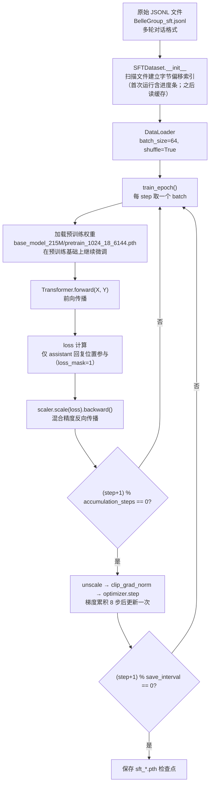

# SFT（监督微调）数据流与张量变换全解析

> [!NOTE]
> 以下分析基于**实际 SFT 训练配置**（`train_SFT_model.py` 中的 `ModelConfig`）：
> `dim=1024, n_layers=18, n_heads=16, n_kv_heads=8, vocab_size=6144, max_seq_len=512`
> 训练参数：`batch_size=64, accumulation_steps=8`，输入序列长度 `seq_len=511`（X = input_id[:-1]）
> **与预训练的核心区别**：SFT 仅对 **assistant 回复部分** 计算 loss，通过 `loss_mask` 实现。

---

## 0. 完整 SFT 训练流程概览



> [!IMPORTANT]
> SFT 与预训练的关键区别：
> 1. **数据格式**：多轮对话（chat template），而非纯文本llama2_data_flow.md
> 2. **Loss 掩码**：只对 `<|im_start|>assistant` 之后的内容计算 loss，忽略 system/user 部分
> 3. **初始权重**：从预训练 checkpoint 加载，而非随机初始化

---

## 1. 数据流：从磁盘到 GPU

### 1.1 原始数据格式（JSONL）

SFT 数据每行是一个 **多轮对话列表**，符合 HuggingFace chat template 规范：

```json
[
  {"role": "system", "content": "你是一个AI助手。"},
  {"role": "user",   "content": "请介绍一下深度学习。"},
  {"role": "assistant", "content": "深度学习是机器学习的一个子领域..."}
]
```

```
文件结构（每行一条对话）：
BelleGroup_sft.jsonl
├── line 0: [{"role":"system",...}, {"role":"user",...}, {"role":"assistant",...}]
├── line 1: [{"role":"user",...}, {"role":"assistant",...}, {"role":"user",...}, ...]
└── ...
```

### 1.2 SFTDataset 初始化

```python
# src/dataset.py — SFTDataset.__init__
cache_file = data_path + ".offsets.npy"
# 首次运行：逐字节扫描整个文件，记录每行起始偏移量
# 后续运行：直接从 .npy 文件加载，秒级完成
```

与预训练相同的字节偏移索引机制，避免将大文件全量加载入内存。

### 1.3 Chat Template 应用（__getitem__ 第一步）

```python
# src/dataset.py — SFTDataset.__getitem__
sample = json.loads(line)   # 解析为对话列表

# apply_chat_template 将对话转换为带特殊标记的字符串
text = tokenizer.apply_chat_template(
    sample, tokenize=False, add_generation_prompt=False
)
```

**📌 数据示例**（对话列表 → chat template 字符串）：
```
输入（对话列表）：
  [{"role": "user", "content": "你好"},
   {"role": "assistant", "content": "你好！有什么可以帮助你的吗？"}]

输出（chat template 字符串）：
  "<|im_start|>user\n你好<|im_end|>\n<|im_start|>assistant\n你好！有什么可以帮助你的吗？<|im_end|>\n"

经 tokenizer 编码后的 input_id（示例）：
  [1,  7890, 198, ...,  2,  198,  1,  3112, 198, ...,  2,  198]
   ↑                    ↑         ↑                     ↑
 im_start             im_end   im_start               im_end
 +user                         +assistant
```

### 1.4 生成 loss_mask（SFT 核心）

```python
# src/dataset.py — SFTDataset.generate_loss_mask
def generate_loss_mask(self, input_id: list) -> list:
    mask = [0] * len(input_id)
    a_sequence = self.tokenizer("<|im_start|>assistant\n").input_ids
    a_length = len(a_sequence)
    i = 0
    while i < n - a_length:
        if input_id[i : i + a_length] == a_sequence:   # 找到 assistant 回复开头
            for idx in range(i + a_length, n):
                if input_id[idx] == eos_token_id:       # 找到 EOS 结束
                    j = idx
                    break
            for pos in range(i + a_length, j + 1):
                mask[pos] = 1                           # 只标记 assistant 内容
            i += a_length
        else:
            i += 1
    return mask
```

**📌 数据示例**（loss_mask 生成过程）：
```
完整 input_id（简化，用符号表示 token）：
  位置:  0    1    2    3    4    5    6    7    8    9   10   11   12
  token: BOS [usr] \n  你   好  [end] \n [ast] \n  你   好！  ！ [eos]
         ↑用户部分↑              ↑————————assistant部分——————↑

a_sequence = tokenizer("<|im_start|>assistant\n").input_ids
           ≈ [BOS, [ast], \n]  (位置 6~8)

扫描过程：
  i=6: input_id[6:9] == a_sequence? YES
  → 向后找 EOS，在位置 12 找到
  → 标记 mask[9..12] = 1

loss_mask（长度512）：
  位置:   0    1    2    3    4    5    6    7    8    9   10   11   12  13..511
  mask:  [0,   0,   0,   0,   0,   0,   0,   0,   0,   1,   1,   1,   1,  0...]
         ←————用户/system 部分，mask=0————→   ←——assistant 回复，mask=1——→
```

> [!IMPORTANT]
> 只有 assistant 回复（含 EOS token）的位置 `mask=1`，参与 loss 计算。
> user/system 的输入内容 `mask=0`，**不计算 loss、不产生梯度**。
> 这是 SFT 与预训练最本质的区别。

### 1.5 __getitem__ 完整流程

```python
# 编码 + 截断
input_id = tokenizer(text).data["input_ids"][: self.max_length]   # 截断到 512

# 填充
text_len = len(input_id)
padding_len = self.max_length - text_len
input_id = input_id + [self.padding] * padding_len               # 填充到 512

# 生成 loss_mask（在填充后调用，padding 位置自然为 0）
loss_mask = self.generate_loss_mask(input_id)                    # 长度 512

# 错位分割
input_id = np.array(input_id)
X = np.array(input_id[:-1]).astype(np.int64)        # [511]  输入
Y = np.array(input_id[1:]).astype(np.int64)         # [511]  目标
loss_mask = np.array(loss_mask[1:]).astype(np.int64) # [511]  掩码也错位
```

```
input_id (512): [BOS, usr_tok..., end, ast_tok..., 你好！, eos, PAD, PAD, ...]
                  ↓ 错位分割
X (511):   [BOS, usr_tok..., end, ast_tok..., 你好！, eos, PAD, ...]  ← 输入
Y (511):   [usr_tok..., end, ast_tok..., 你好！, eos, PAD, PAD, ...]  ← 目标
mask (511): [0, 0, ..., 0, 0, 1, 1, ..., 1, 1, 0, 0, ...]             ← 掩码也错位1位
            ↑────── user/system: 0 ──────↑ ↑── assistant: 1 ──↑
```

> [!TIP]
> `loss_mask[1:]` 与 X/Y 保持**错位一致**：mask[i] 表示"预测 Y[i]（即 input_id[i+1]）时是否计算 loss"，精确对齐 assistant 回复的预测位置。

### 1.6 DataLoader 组装 Batch

```
X:          [64, 511]   int64   ← 64个对话的输入序列
Y:          [64, 511]   int64   ← 64个对话的目标序列
loss_mask:  [64, 511]   int64   ← 只有 assistant 回复位置为 1
```

---

## 2. 预训练权重加载

SFT 从预训练 checkpoint 出发，而非随机初始化：

```python
# train_SFT_model.py — init_model()
ckp = './base_model_215M/pretrain_1024_18_6144.pth'
state_dict = torch.load(ckp, map_location=args.device)

# 清理 torch.compile 产生的前缀
unwanted_prefix = '_orig_mod.'
for k, v in list(state_dict.items()):
    if k.startswith(unwanted_prefix):
        state_dict[k[len(unwanted_prefix):]] = state_dict.pop(k)

model.load_state_dict(state_dict, strict=False)   # strict=False 允许部分键不匹配
```

> [!NOTE]
> `strict=False` 的原因：SFT 阶段可能添加了预训练时没有的参数（如 LoRA adapter），
> 或预训练权重中有 SFT 模型不需要的键，允许灵活加载。

---

## 3. 学习率调度（余弦退火）

```python
# train_SFT_model.py — get_lr(it, all)
min_lr = args.learning_rate / 10   # 2e-5（默认 learning_rate=2e-4）

# 阶段1：warmup_iters=0，直接跳过预热
# 阶段2：余弦退火
decay_ratio = (it - warmup_iters) / (lr_decay_iters - warmup_iters)  # 0→1
coeff = 0.5 * (1 + cos(π × decay_ratio))   # 1→0
lr = min_lr + coeff × (learning_rate - min_lr)  # 2e-4 → 2e-5
```

```
全局 step = epoch × iter_per_epoch + step_in_epoch
SFT 通常只训 1 epoch（args.epochs=1 默认）
```

> [!TIP]
> SFT 阶段学习率比预训练**更小**（2e-4 vs 2e-4），且通常 epoch 数更少（1~3 轮），
> 防止灾难性遗忘预训练中学到的知识。

---

## 4. Transformer 前向传播

> 输入：`X: [64, 511]`，`Y: [64, 511]`
> **与预训练完全相同的模型结构**，区别仅在于 loss 计算阶段。

### 4.1 Token Embedding

```python
h = self.tok_embeddings(tokens)   # nn.Embedding(6144, 1024)
h = self.dropout(h)               # Dropout(p=0.0)
```

```
tokens: [64, 511]         ← 整数 token ID
h:      [64, 511, 1024]   ← 每个 token 映射为 1024 维向量
```

**📌 数据示例**（取第0个对话、前3个token）：
```
tokens[0, :3] = [1, 7890, 198]   # [<|im_start|>, user_token, \n]

h[0, :3, :5] ≈
  token[1]:    [ 0.0231, -0.1052,  0.0874, -0.0423,  0.1190]
  token[7890]: [-0.0918,  0.2341, -0.0512,  0.1876, -0.0763]
  token[198]:  [ 0.1405, -0.0234,  0.0991,  0.0327, -0.1584]
```

### 4.2 RoPE 频率截取

```python
freqs_cos = self.freqs_cos[:511]   # [511, 32]
freqs_sin = self.freqs_sin[:511]   # [511, 32]
```

### 4.3 通过 18 层 DecoderLayer

```
每层结构（Pre-Norm）：
  h = x + Attention(RMSNorm(x), freqs_cos, freqs_sin)
  out = h + MLP(RMSNorm(h))

18 层后：
  h: [64, 511, 1024]   形状不变，但语义已充分融合
```

详细的 Attention（GQA）/ MLP（SwiGLU）结构与预训练完全一致，
参见 `llama2_data_flow.md` 第 4~6 节。

---

## 5. SFT Loss 计算（核心差异）

### 5.1 Transformer 内部：逐 token cross-entropy

```python
# src/model.py — Transformer.forward
self.last_loss = F.cross_entropy(
    logits.view(-1, 6144),     # [64×511 = 32704, 6144]  展平
    targets.view(-1),           # [32704]
    ignore_index=0,             # 忽略 pad_token_id=0
    reduction='none'            # 逐 token loss，不聚合
)
# self.last_loss（即 out.loss）: [32704]
```

### 5.2 train_epoch()：loss_mask 过滤

```python
# train_SFT_model.py — train_epoch
loss = out.loss / args.accumulation_steps      # [32704]  ÷ 8
loss_mask = loss_mask.view(-1)                 # [32704]  (0 或 1)
loss = torch.sum(loss * loss_mask) / loss_mask.sum()
# 只对 assistant 回复位置（mask=1）求加权平均
```

**📌 数据示例**（简化为 seq_len=8 的单个对话）：
```
完整序列 Y（目标 token）：
  位置:   0     1      2      3      4      5      6      7
  token: [usr] [你好] [end]  [ast]  [你好！] [eos]  [PAD]  [PAD]

per-token loss（cross entropy）：
  位置:   0      1      2      3      4      5      6      7
  loss:  [2.1,  1.8,  2.3,  0.5,   0.8,   1.2,   0.0,   0.0]
          ↑用户输入，有loss但被掩码过滤↑    ↑assistant回复↑   ↑padding=0↑

loss_mask（错位后）：
  位置:  [0,    0,    0,    0,    1,    1,    0,    0]

有效 loss 计算：
  分子 = 0×2.1 + 0×1.8 + 0×2.3 + 0×0.5 + 1×0.8 + 1×1.2 + 0×0 + 0×0
       = 0.8 + 1.2 = 2.0
  分母 = sum(loss_mask) = 2
  最终 loss = 2.0 / 2 = 1.0

# 预训练的做法（对比）：
  分母 = 6（非 PAD 的所有位置），loss = (2.1+1.8+2.3+0.5+0.8+1.2)/6 = 1.45
  SFT 只学"应该怎么回答"，不学"理解用户输入"
```

> [!IMPORTANT]
> **双重过滤机制**：
> - `ignore_index=0`：过滤 padding（pad_token_id=0 的位置）
> - `loss_mask`：过滤 user/system 输入（即使不是 padding 也不计算 loss）
>
> 两层过滤共同确保模型只从 **assistant 的回复** 中学习。

---

## 6. 梯度更新（混合精度 + 梯度累积）

```python
# 混合精度反向传播
scaler.scale(loss).backward()

# 每 8 步执行一次实际更新
if (step + 1) % 8 == 0:
    scaler.unscale_(optimizer)
    clip_grad_norm_(model.parameters(), max_norm=1.0)   # 梯度裁剪
    scaler.step(optimizer)    # AdamW 更新
    scaler.update()
    optimizer.zero_grad(set_to_none=True)
```

```
梯度累积逻辑：
  step 0: loss/8 → backward（梯度累积，仅 assistant 位置有梯度）
  step 1: loss/8 → backward（梯度累积）
  ...
  step 7: loss/8 → backward → 执行 optimizer.step
  ─────────────────────────────────────────
  等价 batch_size = 64 × 8 = 512 的训练
```

> [!NOTE]
> SFT 使用 **AdamW**（带权重衰减），而预训练使用 Adam（无权重衰减）。
> AdamW 在微调阶段更有利于防止过拟合，是 SFT 的常见选择。

**📌 数据示例**（SFT 梯度的稀疏性）：
```
# SFT 中，只有 assistant token 对应的 loss_mask=1，才对梯度有贡献
# 假设 batch 中平均每条对话有 200/511 ≈ 39% 的 token 是 assistant 回复

有效梯度 token 比例 ≈ 39%（其余 user/system/PAD 不贡献梯度）

# 对比预训练（所有非 PAD token 都贡献梯度，比例 ≈ 80%+）
# SFT 梯度更稀疏 → 学习信号更聚焦 → 需要更大 batch_size 或更多累积步数补偿
```

---

## 7. 检查点保存

```python
# 两种保存策略并存：
# 1. 按 save_interval 保存（默认每 1000 步）
ckp = f'{args.save_dir}/sft_dim{lm_config.dim}_layers{lm_config.n_layers}_vocab_size{lm_config.vocab_size}.pth'

# 2. 每 20000 步额外保存带步数标记的版本
ckp = f'{args.save_dir}/sft_dim1024_layers18_vocab_size6144_step20000.pth'

# 多卡支持
state_dict = model.module.state_dict() if isinstance(model, torch.nn.DataParallel) else model.state_dict()
torch.save(state_dict, ckp)
```

```
输出文件示例：
sft_model_215M/
├── sft_dim1024_layers18_vocab_size6144.pth          ← 最新检查点（覆盖写）
├── sft_dim1024_layers18_vocab_size6144_step20000.pth ← 第 20000 步快照
└── sft_dim1024_layers18_vocab_size6144_step40000.pth ← 第 40000 步快照
```

---

## 8. 推理：SFT 模型对话生成

SFT 后模型的生成方式与预训练相同（自回归），但**输入格式必须匹配 chat template**：

```python
# 推理时，输入需要按 chat template 格式构造
prompt = tokenizer.apply_chat_template(
    [{"role": "user", "content": "请介绍深度学习"}],
    tokenize=True,
    add_generation_prompt=True,   # 添加 <|im_start|>assistant\n，触发模型回复
    return_tensors="pt"
)
# prompt 末尾是 "<|im_start|>assistant\n"，引导模型续写 assistant 的回复

output = model.generate(prompt, max_new_tokens=256, temperature=0.7, top_k=50)
```


---

## 9. SFT vs 预训练对比速查表

| 维度 | 预训练（train_model.py） | SFT（train_SFT_model.py） |
|------|------------------------|--------------------------|
| **数据格式** | 纯文本 JSONL（`{"text": "..."}` ） | 多轮对话 JSONL（chat template） |
| **Dataset 类** | `PretrainDataset` | `SFTDataset` |
| **初始权重** | 随机初始化 | 加载预训练 `.pth` |
| **loss_mask** | 全部非 padding 位置 | 仅 assistant 回复位置 |
| **优化器** | `Adam` | `AdamW` |
| **batch_size** | 64 | 64 |
| **学习率** | 2e-4（余弦退火） | 2e-4（余弦退火） |
| **目标** | 学习语言建模能力 | 学习按指令回复 |
| **训练轮数** | 多 epoch | 通常 1~3 epoch |

---

## 10. 完整张量变换速查表（SFT）

> 配置：`dim=1024, n_layers=18, n_heads=16, n_kv_heads=8, vocab_size=6144`
> 训练输入：`batch_size=64, seq_len=511`

| 阶段 | 操作 | 输入 | 输出 |
|------|------|------|------|
| **数据** | Chat template | 对话列表 | 带标记字符串 |
| | Tokenize + pad | 字符串 | `[512]` int64 |
| | generate_loss_mask | `[512]` | `[512]` mask |
| | 错位分割 | `[512]` | X/Y/mask: `[511]` |
| | DataLoader | 64 个样本 | `[64, 511]` × 3 |
| **预训练权重** | torch.load | `.pth` 文件 | state_dict |
| | load_state_dict | state_dict | 初始化 model |
| **Embedding** | `tok_embeddings` | `[64, 511]` | `[64, 511, 1024]` |
| | 截取 RoPE | `[512, 32]` | `[511, 32]` freqs |
| **×18 DecoderLayer** | RMSNorm | `[64, 511, 1024]` | `[64, 511, 1024]` |
| **Attention (GQA)** | `wq` 投影 | `[64, 511, 1024]` | `[64, 511, 16, 64]` |
| | `wk/wv` 投影 | `[64, 511, 1024]` | `[64, 511, 8, 64]` |
| | RoPE | Q/K 不变形状 | 值被旋转 |
| | repeat_kv | `[64, 511, 8, 64]` | `[64, 511, 16, 64]` |
| | Flash Attn | Q/K/V: `[64,16,511,64]` | `[64, 16, 511, 64]` |
| | 合并多头 + `wo` | `[64, 16, 511, 64]` | `[64, 511, 1024]` |
| **MLP (SwiGLU)** | RMSNorm | `[64, 511, 1024]` | `[64, 511, 1024]` |
| | w1/w3 升维 | `[64, 511, 1024]` | `[64, 511, 2752]` ×2 |
| | SwiGLU + w2 | `[64, 511, 2752]` ×2 | `[64, 511, 1024]` |
| **输出** | 最终 RMSNorm | `[64, 511, 1024]` | `[64, 511, 1024]` |
| | LM Head（训练） | `[64, 511, 1024]` | `[64, 511, 6144]` |
| | cross_entropy | `[32704, 6144]` vs `[32704]` | `[32704]` per-token loss |
| **SFT 特有** | loss_mask 过滤 | `[32704]` loss + `[32704]` mask | scalar loss（仅 assistant） |
| **反向传播** | 梯度累积 ×8 步 | — | — |
| | clip_grad_norm | — | max 1.0 |
| | AdamW step | — | 更新 215M 参数 |
